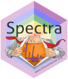
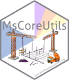

# Mass Spectrometry Data Analysis with `Spectra`

[](https://creativecommons.org/licenses/by-nc/4.0/)

[](https://hub.docker.com/repository/docker/jorainer/spectra_tutorials)





Tutorials and workshops describing and explaining the infrastructure for mass
spectrometry (MS) data analysis centered around Bioconductor's
[*Spectra*](https://bioconductor.org/packages/Spectra) package.

These Workshops are also given (either in-person or virtually) at various
conferences. If available, recordings of these are linked below in the
respective workshop section.

See [NEWS.md](NEWS.md) for information on the current version and a change log.


## Installation

For on-line code evaluation the workshops can also be run using a self-contained
docker image with all R packages and a server version of RStudio (Posit)
pre-installed. As an alternative, rendered versions of all workshops are
available at [SpectraTutorials](https://jorainer.github.io/SpectraTutorials)
(navigate to the *Articles* drop-down menu and select the workshop of interest).

For installation:

- Get the [docker image](https://hub.docker.com/r/jorainer/spectra_tutorials) of
  this tutorial with `docker pull jorainer/spectra_tutorials:latest`.
- Start docker using
  ```
  docker run \
      -e PASSWORD=bioc \
      -p 8787:8787 \
      jorainer/spectra_tutorials:latest
  ```
- Enter `http://localhost:8787` in a web browser and log in with username
  `rstudio` and password `bioc`.
- In the RStudio server version: open any of the R-markdown (*.Rmd*) files in
  the *vignettes* folder and evaluate the R code blocks.


# Workshops/Tutorials

## Seamless Integration of Mass Spectrometry Data from Different Sources

[rendered
version](https://jorainer.github.io/SpectraTutorials/articles/analyzing-MS-data-from-different-sources-with-Spectra.html)

### Short description

In this workshop we will use
[*Spectra*](https://bioconductor.org/packages/Spectra) to:

- import MS data from *mzML* files,
- select MS2 spectra for a certain compound,
- compare and match the MS2 spectra against *reference* MS2 spectra from a
  public database,
- annotate the spectra and export them to a file in *MGF* format.

### Description

This (instructor-led live demo)
[workshop](https://jorainer.github.io/SpectraTutorials/articles/analyzing-MS-data-from-different-sources-with-Spectra.html)
explains the *Spectra* package and shows how this new infrastructure can be used
to represent and analyze Mass Spectrometry (MS) data. The use of different data
type and format specific *backends* guarantees an easy expandability of the
infrastructure. This is illustrated in this tutorial on a simple use case, in
which MS/MS (a.k.a. MS2) spectra, measured by an MS instrument, are compared and
*matched* against a public spectral database containing public domain reference
MS2 spectra.

The video recording of this workshop at the
[BioC2021](https://bioc2021.bioconductor.org/) conference is available
[here](https://youtu.be/CNvqlK3Wgx4).

The video recording of this workshop at the
[EuroBioc2020](https://eurobioc2020.bioconductor.org/) conference is available
[here](https://www.youtube.com/watch?v=W6JISCrAtk0).

### Workshop goals and objectives

#### Learning goals

- Understand how to import MS data into R.
- Understand the basic concept how different *backends* can be used in *Spectra*
  to work with MS data from various sources.

#### Learning objectives

- Import and export MS data with *Spectra*.
- Integrate MS data from different resources into an MS data analysis workflow.
- Apply different data manipulations on MS data represented as a `Spectra`
  object.
- Use *Spectra* to perform spectra comparisons in R.

### Pre-requisites

- Basic familiarity with R and Bioconductor.
- Basic understanding of Mass Spectrometry (MS) data.

### R/Bioconductor packages used

- [*Spectra*](https://bioconductor.org/packages/Spectra)
- [*MsCoreUtils*](https://bioconductor.org/packages/MsCoreUtils)
- [*MsBackendMgf*](https://bioconductor.org/packages/MsBackendMgf)
- [*MsBackendMassbank*](https://bioconductor.org/packages/MsBackendMassbank)
- [*CompoundDb*](https://bioconductor.org/packages/CompoundDb)


## *Spectra*: an expandable infrastructure to handle mass spectrometry data

[rendered version](https://jorainer.github.io/SpectraTutorials/articles/Spectra-backends.html)

### Short description

- Explain different *representations* of mass spectrometry data along with their
  properties and advantages.
- Explain the caching and lazy processing queue of the
  [*Spectra*](https://bioconductor.org/packages/Spectra) package.


### Description

The *Spectra* package provides a modern infrastructure for MS data handling
specifically designed to enable extension to additional data resources or
alternative data representations. These can be realized by extending the virtual
`MsBackend` class and its related methods. Implementations of such `MsBackend`
classes can be tailored for specific needs, such as low memory footprint, fast
processing, remote data access, or also support for specific additional data
types or variables. Importantly, data processing of `Spectra` objects is
independent of the backend in use due to a lazy evaluation mechanism that caches
data manipulations internally.

This workshop discusses different available data representations for MS data
along with their properties, advantages and performances. In addition,
*Spectra*'s concept of lazy evaluation for data manipulations is presented, as
well as a simple caching mechanism for data modifications. Finally, it explains
how new `MsBackend` instances can be implemented and tested to ensure
compliance.

### Pre-requisites

- Basic familiarity with R and Bioconductor.
- Basic understanding of Mass Spectrometry (MS) data.

### R/Bioconductor packages used

- [*Spectra*](https://bioconductor.org/packages/Spectra)
- [*MsBackendSql*](https://bioconductor.org/packages/MsBackendSql)

### Workshop goals and objectives

This is a more technical demonstration of the internals of the *Spectra* package
and design of its MS infrastructure. We're not demonstrating any use cases or
analysis workflows here.

#### Learning goals

- Understand how MS data is handled with *Spectra*.
- Understand differences and properties of different `MsBackend`
  implementations.

#### Learning objectives

- Learn how MS data is handled with *Spectra*.
- Understand which data representations/backends fit which purpose/use case.
- Insights into the internals of the *Spectra* MS infrastructure to facilitate
  implementation of own backend(s).


## MS/MS Spectra Matching with the *MetaboAnnotation* Package

[rendered version](https://jorainer.github.io/SpectraTutorials/articles/Spectra-matching-with-MetaboAnnotation.html)

The [*Spectra*](https://bioconductor.org/packages/Spectra) package provides all
the functionality required for annotation and identification workflows for
untargeted LC-MS/MS data, but, while being very flexible and customizable, it
might be too cumbersome for beginners or analysts not accustomed with R. To fill
this gap we developed the
[*MetaboAnnotation*](https://bioconductor.org/packages/MetaboAnnotation)
package that builds upon *Spectra* and provides functions for annotation of
LC-MS and LC-MS/MS data sets tailored towards the less experienced R user.

This tutorial shows how *MetaboAnnotation* can be used in R-based LC-MS/MS
annotation workflows.

Note that there is also an additional tutorial for the *MetaboAnnotation*,
*CompoundDb* and *MetaboCoreUtils* packages available:
[MetaboAnnotationTutorials](https://jorainer.github.io/MetaboAnnotationTutorials).


## Contribution

For contributions, see the [RforMassSpectrometry contributions
guideline](https://rformassspectrometry.github.io/RforMassSpectrometry/articles/RforMassSpectrometry.html#contributions).


## Code of Conduct

See the [RforMassSpectrometry Code of
Conduct](https://rformassspectrometry.github.io/RforMassSpectrometry/articles/RforMassSpectrometry.html#code-of-conduct).


# Acknowledgments

Thank you to [Philippine Louail](https://github.com/philouail) for
fixing typos and suggesting improvements in the *Spectra: an expandable
infrastructure to handle mass spectrometry data*.
